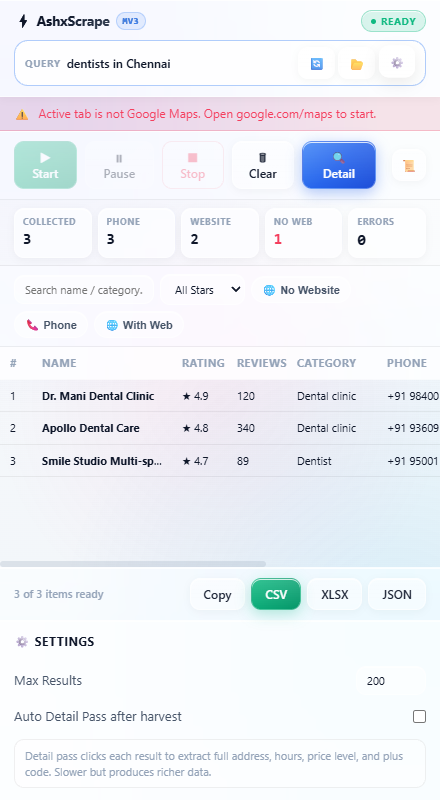

<div align="center">


# AshxScrape

**High-performance Manifest V3 Chrome extension for structured business data extraction from Google Maps search results.**

[](https://developer.chrome.com/docs/extensions/mv3/)
[](LICENSE)
[](https://vitejs.dev/)
[](https://developer.mozilla.org/en-US/docs/Web/API/IndexedDB_API)
[-red?logo=adobe-acrobat-reader&logoColor=white)](docs/AshxScrape_Complete_Architectural_Guide.pdf)
[](https://github.com/aswinhub26/AshxScrape/pulls)

[Key Features](#key-features) • [Installation](#installation) • [Workflow](#workflow) • [Data Schema](#data-schema) • [Architecture](#architecture) • [PDF Guide](docs/AshxScrape_Complete_Architectural_Guide.pdf) • [Security](#security--guardrails)

</div>


---

## Overview

**AshxScrape** is an open-source, client-side Chrome extension built on Manifest V3. It automates the extraction, normalization, and export of public business listing data directly from Google Maps search result pages. 

The extension runs entirely within the browser without requiring external API tokens or remote proxy services, preserving user privacy while avoiding Google Places API rate and billing constraints.

```
+-----------------------------------------------------------------------------+
|                                AshxScrape Pipeline                          |
|                                                                             |
|  Google Maps Feed  -->  List Scraper  -->  Virtual Table  -->  Detail Pass  |
|   (DOM Scroller)       (Card Parser)       (IndexedDB)       (Enrichment)   |
|                                                                    |        |
|                                                                    v        |
|                                                          CSV / XLSX / JSON  |
+-----------------------------------------------------------------------------+
```

---

## Key Features

- **Automated Feed Ingestion**
  - Smooth virtual scrolling on `div[role="feed"]` with dynamic boundary and end-of-list detection.
  - Zero-drop place identifier (`CID` / `placeId`) deduplication across all scroll iterations.

- **Human-Mimetic Throttling**
  - Randomized request jitter (900ms–1800ms) across scroll steps and navigation actions to minimize rate-limiting signals.

- **Deep Detail Enrichment Pass**
  - Two-stage extraction pipeline: fast list-card ingestion followed by an optional automated detail pass.
  - Extracts full street address, standardized operating hours, price level indicators, Google Plus Codes, and business claim status.

- **High-Throughput Virtualized UI**
  - DOM-virtualized preview table capable of rendering 5,000+ extracted records with only ~27 DOM elements active in memory (~29ms initial mount, 10ms frame scroll).

- **Multi-Condition Lead Filtering**
  - Single-click targeting filters: *No Website* (high-intent lead generation), *Has Phone*, minimum review star rating, and real-time substring search.

- **Export Formats & Sanitization**
  - **CSV**: RFC 4180 compliant with UTF-8 BOM and formula injection protection (automatic neutralization of `=`, `+`, `-`, `@` prefixes).
  - **XLSX**: Formatted Excel workbook via SheetJS with automatic column sizing, frozen headers, and job metadata sheet.
  - **JSON**: Structured envelope output with execution metadata, field manifest, and timestamp.
  - **TSV Clipboard**: Instant tab-separated copy for one-click pasting into Google Sheets or Microsoft Excel.

- **Local Session Persistence**
  - High-capacity IndexedDB storage layer (`AshxScrapeDB`). Allows loading, filtering, and exporting historical extraction runs across browser restarts.

---

## Preview

<div align="center">

| Side Panel Interface | Lead Filtering View |
|:---:|:---:|
|  |  |

| Virtualized Table (5,000+ Rows) | Multi-Drawer Controls |
|:---:|:---:|
|  |  |

</div>

---

## Installation

### Option 1: Load Pre-built Extension (Fastest)

1. Clone or download this repository:
   ```bash
   git clone https://github.com/aswinhub26/AshxScrape.git
   cd AshxScrape
   ```
2. Open Google Chrome and navigate to `chrome://extensions`.
3. Enable **Developer mode** using the toggle in the top-right corner.
4. Click **Load unpacked** in the top-left toolbar.
5. Select the **`dist/`** directory inside the project root.

---

### Option 2: Build from Source

#### Prerequisites
- Node.js 18.0.0 or higher
- npm 9.0.0 or higher

#### Build Steps
```bash
# 1. Install project dependencies
npm install

# 2. Compile the multi-target bundle (Side Panel, Service Worker, Content Script)
npm run build

# 3. Load the generated dist/ folder in chrome://extensions as an unpacked extension
```

---

## Workflow

```
 1. Search Query     --> Enter search query on Google Maps (e.g., "dental clinics in Austin")
 2. Open Panel       --> Open AshxScrape from Chrome's Side Panel or Extension icon
 3. Harvest          --> Click "Start" to initiate automated scrolling and list ingestion
 4. Detail Pass      --> (Optional) Click "Detail" to enrich listings with hours & addresses
 5. Filter & Review  --> Apply filters ("No Website", "Phone", rating thresholds)
 6. Export           --> Export to CSV, XLSX, JSON, or copy to clipboard
```

---

## Data Schema

Each extracted record adheres to the following standardized data schema:

| Field | Type | Description | Sample Value |
|---|---|---|---|
| `name` | `string` | Registered business title | `Austin Dental Care` |
| `category` | `string` | Primary category classification | `Dental clinic` |
| `rating` | `number` | Average star rating | `4.9` |
| `reviewCount` | `number` | Total number of published reviews | `342` |
| `phone` | `string` | Standardized telephone number | `+1 512-555-0199` |
| `phoneRaw` | `string` | Unformatted source telephone string | `(512) 555-0199` |
| `website` | `string \| null` | External authority website URL | `https://austindental.example.com` |
| `domain` | `string \| null` | Extracted root domain name | `austindental.example.com` |
| `address` | `string \| null` | Complete street address | `1200 S Congress Ave, Austin, TX 78704` |
| `area` | `string \| null` | Neighborhood or district locality | `South Congress` |
| `hours` | `string \| null` | Weekly opening schedule | `Mon-Fri: 8:00 AM - 5:00 PM` |
| `priceLevel` | `string \| null` | Normalized pricing tier | `$$` |
| `plusCode` | `string \| null` | Global open location code | `862476W7+3X Austin` |
| `claimed` | `boolean` | Verified ownership claim status | `true` |
| `latitude` | `number \| null` | Geographic latitude coordinate | `30.2523` |
| `longitude` | `number \| null` | Geographic longitude coordinate | `-97.7491` |
| `placeId` | `string` | Hexadecimal Google Place Identifier | `0x8644b5...:0x1234abcd` |
| `placeUrl` | `string` | Canonical Google Maps listing link | `https://www.google.com/maps/place/...` |
| `query` | `string` | Search query associated with collection | `dental clinics in Austin` |
| `scrapedAt` | `string` | ISO 8601 UTC extraction timestamp | `2026-09-16T00:00:00.000Z` |

---

## Architecture

AshxScrape employs a decoupled, multi-context architecture optimized for Chrome's Manifest V3 execution model:

```
                      +----------------------------------+
                      |       Background Worker          |
                      |   (src/background/service-worker)|
                      +-----------------+----------------+
                                        |
                  chrome.sidePanel.open | chrome.runtime
                                        v
+-----------------------------+                  +-----------------------------+
|       Side Panel UI         | <==============> |       Content Script        |
|     (src/sidepanel/*)       |  two-way stream  |     (src/content/*)         |
|                             |  runtime port    |                             |
| - State Controller          |                  | - Virtual Feed Scroller     |
| - Virtual Table (27 DOM)    |                  | - List Card Parser          |
| - Filter Engine             |                  | - Detail Dialog Scraper     |
| - IndexedDB Client          |                  | - Anti-Bot Jitter Throttler |
| - SheetJS / CSV Generator   |                  | - Selector Health Probe     |
+-----------------------------+                  +-----------------------------+
```

### Directory Structure

```text
ashxscrape/
├── manifest.json              # Extension manifest definition (Manifest V3)
├── build.js                   # Vite multi-target compilation runner
├── package.json               # Package manifests and build scripts
├── README.md                  # Project documentation
├── .gitignore                 # Build and runtime artifact exclusions
├── docs/                      # Architectural assets and screenshots
│   └── screenshots/
├── icons/                     # Standard resolution extension icons
├── dist/                      # Production distribution directory (unpacked load target)
└── src/
    ├── background/
    │   └── service-worker.js  # Service worker handling side panel registration
    ├── content/
    │   ├── index.js           # Content script entry point and port listener
    │   ├── feed-scroller.js   # Automated feed scroller with dynamic boundary checks
    │   ├── list-parser.js     # Fast list card DOM extractor
    │   ├── detail-parser.js   # In-depth detail dialog navigation and extractor
    │   └── selectors.js       # Fallback CSS selector configurations
    ├── sidepanel/
    │   ├── index.html         # Panel markup and layout structure
    │   ├── panel.js           # UI controller, messaging coordinator, and event router
    │   ├── styles.css         # UI stylesheet with light and dark mode support
    │   └── components/
    │       ├── virtual-table.js # Windowed DOM virtual table implementation
    │       └── filter-bar.js    # Client-side predicate filter controller
    ├── lib/
    │   ├── db.js              # IndexedDB interface for job and row storage
    │   ├── dedupe.js          # In-memory entity deduplication utility
    │   ├── export.js          # CSV, XLSX, JSON, and TSV format exporters
    │   ├── schema.js          # Canonical field definitions and sanitizers
    │   └── throttle.js        # Deterministic and jitter delay generators
    └── shared/
        └── messages.js        # Strongly typed messaging contracts and state enums
```

---

## Security & Guardrails

- **Zero Remote Telemetry**: All data processing, storage, and file generation take place in the local browser process. No analytics or tracking payloads are emitted.
- **CSV Injection Neutralization**: All string fields beginning with sensitive spreadsheet formula characters (`=`, `@`, `+`, `-`) are prefixed with single quotes in accordance with OWASP CSV Injection guidelines.
- **Client-Side Selector Auditing**: Probes critical DOM anchors on load and alerts via the log drawer if Google Maps modifies layout conventions.
- **Automatic Block Mitigation**: Real-time heuristic monitoring for CAPTCHA and unusual traffic prompts with automatic harvesting pause safeguards.

---

## Development

```bash
# Start watch mode during development
npm run dev

# Run comprehensive test suites (Puppeteer validation)
node tests/e2e.test.js
```


---

## License

This project is licensed under the [MIT License](LICENSE).
