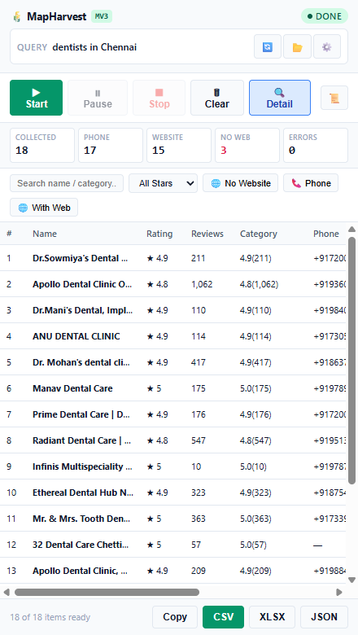
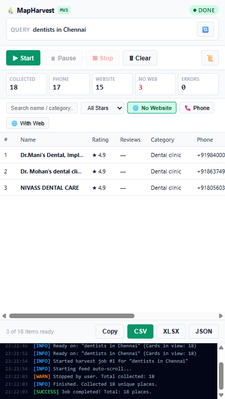
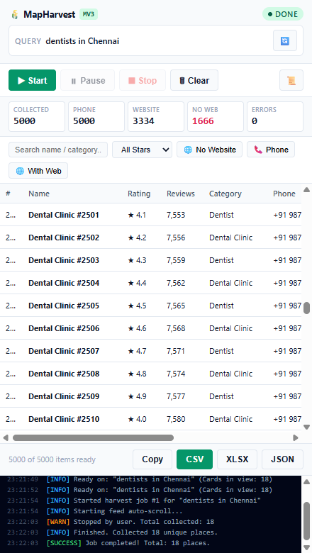

# 🌾 MapHarvest — Google Maps Business Data Scraper

A production-quality **Chrome MV3 Extension** that extracts business listings from Google Maps search results and exports them to **CSV**, **XLSX**, and **JSON**.

---

## ✨ Features

- **Live Feed Scraper** — Auto-scrolls Google Maps results with human-like jitter (900–1800ms) to avoid detection
- **Virtual Table** — Renders 5,000+ rows with only ~27 DOM nodes (29ms load, 10ms scroll)
- **Lead-Gen Filters** — "No Website" money filter, star rating, phone, and text search
- **Detail Pass** — Clicks each place to extract full address, opening hours, price level, plus code, and claimed status
- **Export Formats** — RFC 4180 CSV (UTF-8 BOM, formula injection guards), SheetJS XLSX, and structured JSON
- **Job History** — IndexedDB persistence with load-back for past harvests
- **Block Detection** — Auto-pauses on CAPTCHA / rate-limit signals
- **Selector Health Probe** — Warns in the log when Google Maps changes its DOM

---

## 📸 Screenshots

| Side Panel | No-Website Filter | 5,000-Row Virtual Table |
|:-:|:-:|:-:|
|  |  |  |

---

## 🚀 Installation

### Load Unpacked (Developer Mode)

1. Clone this repo:
   ```bash
   git clone https://github.com/YOUR_USERNAME/mapharvest.git
   cd mapharvest
   ```

2. Install dependencies and build:
   ```bash
   npm install
   npm run build
   ```

3. Open Chrome → `chrome://extensions` → **Developer mode ON**

4. Click **"Load unpacked"** → select the **`dist/`** folder

5. Open [Google Maps](https://maps.google.com), search for a business type (e.g. *dentists in Chennai*), then click the 🌾 MapHarvest icon

---

## 🏗️ Project Structure

```
mapharvest/
├── src/
│   ├── content/
│   │   ├── index.js          # Content script entry (injected into Maps)
│   │   ├── feed-scroller.js  # Auto-scroll engine with jitter
│   │   ├── list-parser.js    # Extracts data from list cards
│   │   ├── detail-parser.js  # Clicks place → extracts hours, address, etc.
│   │   └── selectors.js      # Ordered CSS selector fallback chains
│   ├── sidepanel/
│   │   ├── index.html        # Side panel UI
│   │   ├── panel.js          # Main panel controller
│   │   ├── styles.css        # All UI styles (light + dark mode)
│   │   └── components/
│   │       ├── virtual-table.js  # DOM-virtualized table (5k+ rows)
│   │       └── filter-bar.js     # Live filter engine
│   ├── lib/
│   │   ├── schema.js         # Canonical field definitions & normalizers
│   │   ├── db.js             # IndexedDB persistence layer
│   │   ├── export.js         # CSV / XLSX / JSON / TSV export engines
│   │   ├── dedupe.js         # Place ID deduplication tracker
│   │   └── throttle.js       # Human jitter delay utilities
│   ├── background/
│   │   └── service-worker.js # MV3 background worker
│   └── shared/
│       └── messages.js       # Typed message constants & job states
├── dist/                     # Built extension — load this in Chrome
├── manifest.json
├── build.js                  # Vite multi-target build script
└── package.json
```

---

## 📤 Export Formats

| Format | Details |
|--------|---------|
| **CSV** | RFC 4180, UTF-8 BOM, formula injection guards (`=`, `+`, `-`, `@` escaped) |
| **XLSX** | SheetJS, auto column widths, frozen header, Info metadata sheet |
| **JSON** | Metadata envelope with `meta.query`, `meta.fields`, `meta.exportedAt` |
| **TSV** | Clipboard copy → paste directly into Google Sheets / Excel |

---

## 📋 Extracted Fields

`name`, `category`, `rating`, `reviewCount`, `address`, `area`, `phone`, `website`, `domain`, `hours`, `priceLevel`, `plusCode`, `latitude`, `longitude`, `placeUrl`, `placeId`, `imageUrl`, `claimed`, `scrapedAt`, `query`

---

## ⚙️ Build

```bash
npm install
npm run build   # Outputs to dist/
```

---

## 📄 License

MIT
